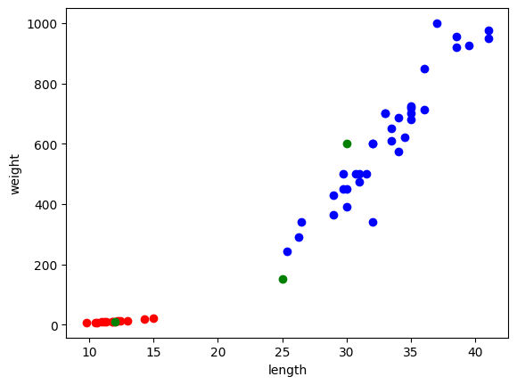

# 결과

(파란색: 도미, 빨간색: 빙어, 초록색: 데이터)

- 새로운 데이터는 1개가 도미, 2개가 빙어로 추측됨
- 새 데이터 중 좌측부터 A, B, C 라고 할 때, A와 C는 각각 빙어와 도미임이 확실했으나, B는 한 개의 범주로 분류하기 다소 애매함. 육안으로 볼 때에는 도미로 추측했으나 KNN 의 결과로는 빙어로 결과가 출력됨

# 배운점 및 느낀점
KNN이 다소 간단한 모델에 속한다고 알고 있었는데 실제로 사용해보니까 간단하면서도 소규모 데이터에 대해서 효과적으로 분류를 진행할 수 있다는 것을 알게되었다.
 
현재 빙어와 도미 데이터는 길이와 무게 2가지 특성을 사용해 2차원 데이터를 사용할 수 있었으나, 여러 특성을 사용해 2차원 이상의 데이터를 사용해야할 때에는 어떻게 해야할지 궁금하기도 했다. matplotlib 라이브러리가 지원하는 그래프가 3차원이 최대일텐데 고차원 환경에서는 matplotlib 라이브러리를 사용하지않던가, KNN 이외의 알고리즘을 사용하는지 궁금하다.

또 앞으로도 KNN 이외의 알고리즘에 대해서도 알아보고 싶다.