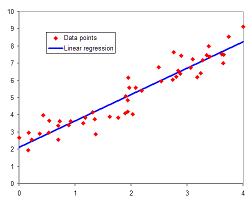
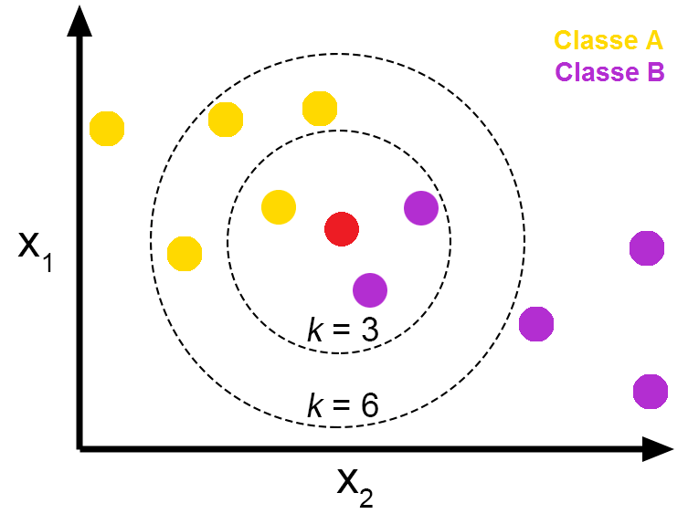
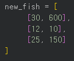
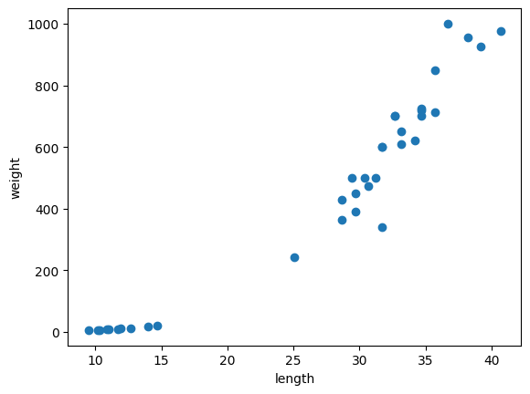
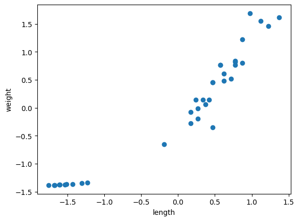

# KNN이란?
KNN(K-Nearest Neighbors, K-최근접 이웃 알고리즘)은 비모수적 지도 학습 분류기로, 근접성을 사용하여 데이터 포인트의 그룹화에 대한 분류 또는 예측을 수행한다. 오늘날 머신러닝에서 사용되는 인기 있고 간단한 분류 및 회귀 분류기 중 하나다.

ref: https://www.ibm.com/kr-ko/think/topics/knn
------
## 비모수적?
머신러닝에서도 모수적 / 비모수적 구분을하고, 통계적추론에서도 모수적 / 비모수적을 구분하지만, 둘은 엄연히 다른 개념이다.

머신러닝에서 모수적(parametic)이란, 데이터들이 함수로 나타낼 수 있는 특정한 패턴을 가지고 있다고 여기는 것이다. 대표적인 예시가 선형회귀. 조금 더 있어보이게 말하면 독립변수와 종속변수 간 특정한 관계를 가지고 있다고 가정하는 방법이다.

반대로 비모수적(non-prarametic)이란, 데이터들의 패턴을 표현할 함수를 따로 정의하지 않는다. 대부분의 머신러닝 알고리즘이 이에 해당한다고. 오늘 알아볼 KNN 알고리즘이 대표적인 비모수적 방법이다. 독립변수와 종속변수 간 특정한 관계가 없다고 가정하는 방법이다.

## 지도 학습 분류기?
분류기야 분류하는 기계라는 것을 알 수 있을 것인데, 지도학습이란 무엇인가?

지도학습에는 회귀와 분류가 있으며, 훈련 시 정답이 포함된 훈련데이터를 같이 전해주면 지도학습(Supervised Learning)이다. 이 정답을 타겟이라고 칭하며(레이블이라고 칭하는 곳도 있다), 분류는 레이블을 통해 분류된 데이터들을 학습한 후, 새 데이터가 들어오면 가장 적절한 곳으로 데이터를 분류하는 과정, 회귀는 첫 데이터부터 시작해 다음에 올 데이터를 예측하고, 그 다음에 온 데이터와 오차를 계산해 오차를 줄여나가는 방식으로 데이터를 학습한 후, 가장 다음 데이터일 가능성이 높은 값을 반환한다.

정규 스터디 시간에 다뤘던 도미와 빙어 구분 문제 역시 도미 데이터와 빙어 데이터에 각각 도미인지 빙어인지 정답을 제공하고, 새 데이터에 대해서 도미인지 빙어인지 분류했으므로 지도학습 분류기라는 것을 알 수 있다.

## 근접성과 데이터 포인트의 그룹화?
"
k-최근접 이웃 알고리즘 (K-Nearest Neighbors)?
“이 데이터와 거리가 가까운 데이터 k개를 찾아서 그 이웃들 이 어떤 정답을 가지고 있는지 보고 다수결로 판단하자!”

- 정규스터디 1주차
https://www.youtube.com/watch?v=IKjvA7QM2Sc
"

새 데이터를 중심으로 가장 가까운 k개의 데이터를 조사해 더 데이터가 속한 분류로 새 데이터가 분류된다는 뜻이다. 위의 사진에서 k = 3이라면 class B, k = 6 이라면 class A에 속한다. 이 k값이 너무 작다면 범주가 지나치게 좁아지며(오버피팅), k값이 너무 크다면 모든 점이 동일한 범주로 분류되어 분류하려는 의미가 없어진다(언더피팅)
(클래스는 분류에서 레이블을 일컫는 또다른 용어인데 classse는 오타인듯하다.)

사이킷런에서 기본 k값은 5다.

 
 KNN을 사용할 때 데이터들은 벡터화를 거치게되는데, 그래서 좌표상에 데이터를 나타낼 수 있는 것이다.

KNN은 표시할 데이터들의 특성들에 따라서 차원의 수가 달라진다. 예를들어서 남자와 여자로 분류하는 KNN모델에서 데이터의 특성이 키와 몸무게 2개라면 2차원 벡터로 표현하고, 키, 몸무게와 수능성적까지 들어간다면 3차원 벡터로 표시한다.

그래서 새 데이터가 벡터평면 상으로 들어오면, 기존 데이터와 거리계산을하고, 가장 가까운 데이터 k개를 골라내는 식으로 동작한다. 거리 계산의 가장 기본은 유클리드 거리를 사용하며, 추가속성으로 다른 거리계산모델을 사용할수도 있다.
위의 그림에서 빨간 데이터가 새로 들어오면 모든 노란데이터, 보라색 데이터와 거리계산을한다. KNN은 간단한 모델이라 가장 가까운 데이터를 찾는 과정 없이 모든 데이터와 거리계산을 수행한다.

그래서 KNN은 데이터가 많아지면 성능이 떨어진다는 단점이 있다. 반면 데이터가 적고 단순한 경우, 낮은차원 벡터로 쉽게 나타낼 수 있는 경우에 KNN이 잘 맞는다. 데이터가 많다면 거리계산을 많이 수행해야하고, 복잡한경우 고차원벡터로 나타내야하는데, 그러면 거리계산을 사용하기 힘들어 KNN을 사용하기 어렵다.

## 정리
KNN은 비모수적 지도 학습 분류기로, 근접성을 사용하여 데이터 포인트의 그룹화에 대한 분류 또는 예측을 수행한다. 오늘날 머신러닝에서 사용되는 인기 있고 간단한 분류 및 회귀 분류기 중 하나다.

다시 위에서 다뤄본 내용으로 풀어써보자면,
KNN은 데이터를 함수로 표현하지 않은채 분류하는 모델로, 미리 분류된 데이터를 통해 새로운 데이터가 주어졌을 때 기존에 학습한 분류 중 어느 분류에 가장 가까운지 알아내는 모델이다. 데이터를 2차원 이상의 벡터값으로 표현 가능하다면 사용할 수 있기 때문에 오늘날 머신러닝에서 사용되는 인기 있고 간단한 분류 및 회귀 분류기 중 하나다.

# KNN을 위한 데이터전처리
## 학습데이터 - 테스트데이터 분리
학습이 잘 되었는지 테스트해보기 위해서 가지고 있는 데이터를 나눠 일부는 학습용도로, 일부는 테스트용도로 사용해야한다. 

## 표준화
KNN과 같은 거리기반모델은 반드시 표준화를 거쳐야한다.
생선 데이터에서 길이와 무게의 단위차이가 크기 때문에, 이 범위를 조절해야하기 때문이다. 만약 표준화가 없다면 벡터 간 거리가 단위가 더 큰 길이의 영향을 크게 받기 시작하며, 데이터가 왜곡될 수 있기 때문이다. 생선 데이터는 약 10배 정도만 차이났지만, 데이터 간 단위차이가 커지면 커질수록 왜곡될 가능성이 매우 높아진다. (그리고 생선데이터도 실제로 왜곡되었다)

따라서 모든 요소들의 영향을 골고루 받을 수 있도록 데이터를 재조정해야한다.

### 최소-최대 정규화

데이터를 1과 0 사이의 값을 스케일링하는 것을 정규화라고한다. 가장 큰 값을 1, 가장 작은 값을 1로 설정해 나머지값들은 그 사이 비율에 맞춰서 스케일링한다. 직관적이지만 최대값보다 큰 값이 새로 주어지거나, 최소값보다 작은 값이 새로 주어지는 등 이상데이터에 대해서는 취약하다는 단점이 있다.

X = (X - MIN) / (MAX - MIN)

### Z-점수 표준화

어떤 데이터가 표준정규분포에 들어가게끔 스케일링하는 것을 Z-점수 표준화라고한다. 고등학교 확률과 통계과목에 나오는 표준화기법으로, 따라서 데이터의 평균은 0이며 분산과 표준편차는 1로 변한다. 이를 통해서 표준정규분포 상에서 데이터가 어디에 위치했는지 알 수 있다. 가령 (0, 0)이라면 길이도 평균, 무게도 평균인 물고기라는 것을 뜻한다. 표준화된 값이 지나치게크다면 평균에서 많이 벗어난 이상치로 간주하고 폐기할 수도 있다. 이를 통해서 N%의 신뢰구간을 보증할 수도 있다는 장점이 있다.

X = (X - mean) / std

# 느낀점
KNN은 그냥 데이터만 주고 계산하게하면 되는 줄 알았는데 또 데이터를 한 번 스케일링하는 과정을 거쳐야한다고한다. 그리고 표준화하는 과정이 스터디에서는 표준점수 구하고, 정렬하고.. 이런 느낌이었는데 알고보니 Z-점수 표준화라는 이름을 가지고 있으며 고등학교 확률과 통계 때 표준화라는 이름으로 등장했다는 사실을 알게되었다. AI 학습하기 전에 기본적인 데이터를 다룰 수 있도록 통계학도 꽤 배워놔야겠다고 생각드는 과제였다..

또 생각보다 B2B, B2C 추천 알고리즘 같은 경우에서 사용자 또는 단체의 특성을 벡터화한 후 거리기반 모델을 사용하여 유저 간 유사도 매칭을하는 아이디어를 봐왔는데, 그걸 보고도 들었던 의문이지만 과연 사용자를 특성 2~3개로 분류할 수 있을지, 아니라면 특성이 여러 개가 필요할 것인데 knn을 그 상황에서도 사용할 수 있을지 생각해보고, 궁금하게 되었다. 사용자 맞춤형, 또는 사용자 매칭 서비스를 위해서는 꼭 깊게 알아둬야하는 사항이라고 생각들었다.
