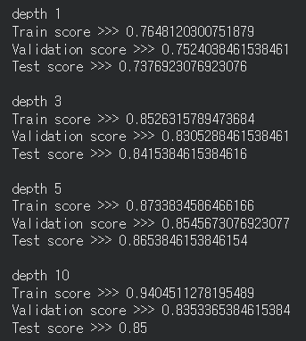
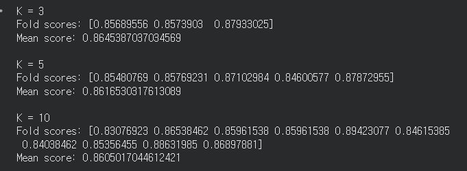
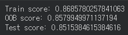

# 배운점
## 결정트리 알고리즘
데이터들을 특정 기준을 가지고 분류하는 작업을 계속하여 트리 구조처럼 데이터들을 분류하는 알고리즘

하지만 트리깊이에 제한을 두지 않으면 데이터를 지나치게 세세하게 분류해 신규 데이터가 들어올 경우 제대로 분류해내지 못하는 과대적합이 발생한다.

### 적절한 depth 찾기
1. Grid Search
개발자가 직접 depth 후보들을 지정한 후 depth마다 테스트 결과를 하나씩 비교해보는 과정.
위의 사진에서 depth를 1, 3, 5, 10으로 바꿔가며 적절한 depth 값을 찾는 과정을 Grid Search라고 할 수 있다.

2. Random Search
개발자가 depth가 될 수 있는 구간을 정해주면 그 구간 내의 임의의 값으로 테스트를 수행한다.

## 교차검증
그리드서치와 랜덤서치 모두 여러 개의 depth 값들을 토대로 데이터를 학습하고 검사받는 구조를 가진다. 하지만 검사하는 과정에서 test_data를 사용하게 된다면 여러 개의 depth 값을 토대로 학습하는 동안 여러 번 테스트 데이터를 확인하게되어 모델이 테스트 데이터도 학습하게 되었는지, 아니면 테스트 데이터를 확인만했는지 알 수 없어진다.

따라서 중간에 validation data를 추가하여 교차검증을 거치게된다. 이 때, 단순히 데이터를 train / validation 데이터로 나누는게 아니라, 데이터를 K등분 한 후, 1개의 validation 데이터와 K-1개의 train 데이터를 사용한다. K등분된 데이터들 중 validation data는 각 depth마다 다르게 선정된다.

이를 k-fold 교차 검증이라고하며, 테스트할 때마다 점수를 출력하거나 평균점수를 출력할 수 있다.

# 앙상블
결정트리 역시 여러 개의 결정트리를 만들어두고 안정적으로 분류할 수 있는 결정트리를 선택해서 사용한다면 더 안전하게 데이터를 학습시킬 수 있다. 이렇게 여러 개의 트리 중에서 성능이 좋은 1개의 트리를 선정하는 것을 RandomForest라고 칭한다.

랜덤 포레스트에서 각 트리는 훈련데이터들을 모두 훈련하는데 사용하지 않고, 훈련데이터를 중복을 허용하여 무작위로 뽑아서 훈련한다. 이 때 뽑히지 않은 데이터셋들은 검증데이터로 사용할 수 있다.

# 느낀점
수업 시간에 했던 말처럼 스무고개와 같이 진짜로 데이터들을 일정 기준을 갖고 분류시킬 수 있구나 생각들었다. 또한 어디서나 과대적합이 발생할 수 있으니 max_depth를 지정해야한다는 것도

이전에 로지스틱 회귀에서 엘라스틱 서치와 함께 사용해보고싶다고 했는데, 실제로 특성을 분류하거나, 패턴 등을 분석할 때에는 로지스틱 회귀와 같은 선형분류도 필요하지만 결정트리와 같은 비선형분류를 해야하는 상황이 많지 않나 생각들었다. 그렇기 때문에 로지스틱 회귀와 더불어서 사용해 볼 수도 있을 것..같다.